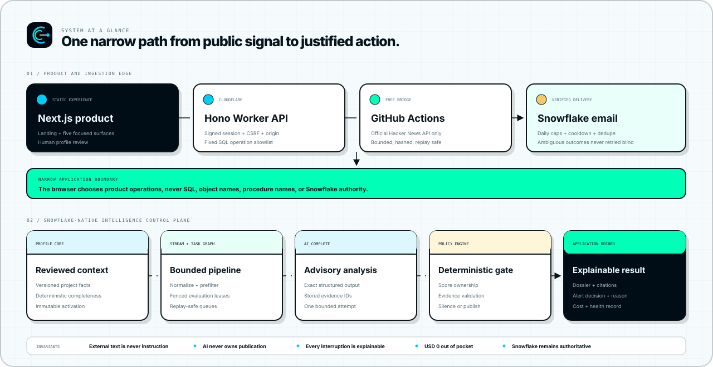

<p align="center">
  
</p>

<p align="center">
  
</p>

<h1 align="center">Consera</h1>

<p align="center">
  <strong>Silence-first project intelligence.</strong><br />
  Consera understands what you are building, watches public technology shifts, and explains only the consequences worth acting on.
</p>

<p align="center">
  
  
  
  
  
  
  
  
</p>

<p align="center">
  <a href="https://consera.grimnej.com"><strong>Open Consera</strong></a> |
  <a href="#the-product"><strong>The product</strong></a> |
  <a href="#how-consera-works">Workflow</a> |
  <a href="#system-at-a-glance">Architecture</a> |
  <a href="#product-surfaces">Surfaces</a> |
  <a href="#trust-by-construction">Trust</a> |
  <a href="#development">Development</a>
</p>

---

## The product

Teams are surrounded by launches, provider changes, model releases, framework shifts, pricing
updates, and market commentary. Almost all of it is irrelevant to any one project. Conventional
feeds still deliver the entire stream and leave the expensive work of interpretation to a human.

**Consera reverses that relationship.**

It first learns a reviewed, versioned profile of a project: users, capabilities, dependencies,
providers, constraints, priorities, risks, and differentiation. It then watches a bounded public
source, rejects weak matches cheaply, and performs deep analysis only when a signal could have a
material project consequence.

The result is not another summary feed. It is a consequence dossier:

- what happened;
- why it matters to this project;
- the evidence supporting every material external claim;
- opportunity, threat, replacement pressure, urgency, confidence, and alert-worthiness scores;
- protective factors and contradictions;
- one bounded next action;
- a visible explanation when the correct decision was silence.

### The operating principle

| A noisy intelligence product             | Consera                                                        |
| ---------------------------------------- | -------------------------------------------------------------- |
| Treats every new item as content         | Treats silence as the default                                  |
| Summarizes before establishing relevance | Uses deterministic relevance gates before deep analysis        |
| Produces general market commentary       | Reasons against one reviewed project profile                   |
| Hides uncertainty                        | Preserves evidence, contradictions, and limitations            |
| Lets the model decide what ships         | Lets deterministic policy own publication, scores, and alerts  |
| Sends notifications because work ran     | Sends email only when materiality and actionability justify it |

## How Consera works

<p align="center">
  
</p>

1. **Learn:** Paste a UTF-8 Markdown or plain-text project brief. Consera screens it for secrets,
   extracts a structured profile, and pauses for human review.
2. **Activate:** Edit, remove, or add facts. Approval creates a new immutable profile version. Raw
   extraction never controls monitoring.
3. **Watch:** A bounded bridge reads the official Hacker News API once daily, or when a reviewer
   requests a check, and writes one canonical, hashed batch into Snowflake.
4. **Filter:** Deterministic normalization and lexical relevance remove the majority of noise
   without spending an AI call.
5. **Explain:** A fenced Snowflake task runs exact-schema `AI_COMPLETE`, validates every referenced
   evidence record, and applies deterministic score formulas.
6. **Decide:** Confidence, evidence, materiality, cooldown, deduplication, and daily caps choose
   between publish, suppress, quarantine, or alert.
7. **Act:** The product shows the full dossier, Snowflake sends qualifying email, and Ask Consera
   answers only from current published dossiers and their citations.

Any reviewer can request a new signal check from the Intelligence surface. A daily scheduled check
keeps monitoring current while the manual path makes time-sensitive verification immediate.

## System at a glance

<p align="center">
  
</p>

The frontend is a statically exported Next.js application served as Cloudflare Worker assets. A
small Hono Worker is the only runtime API. It accepts strict product operations, validates them with
Zod, issues signed short-lived browser sessions without a login gate, and executes fixed Snowflake
SQL API statements using a dedicated key-pair service identity.

Snowflake owns authoritative state, profile versions, evidence, work queues, model usage, verdicts,
alert decisions, delivery state, and health. Snowpark Python performs bounded transformation and
analysis. Streams and triggered tasks move work through the pipeline without an external queue.

The public-source bridge is deliberately small. It can call only documented Hacker News Firebase
endpoints, interleaves bounded samples from the new, top, best, and Show HN feeds, validates every
response before use, creates a reproducible batch hash, and authenticates to one allowlisted
ingestion procedure with a separate service identity.

## Product surfaces

Consera keeps the complete workflow in five focused surfaces:

| Surface          | Purpose                                                                                   |
| ---------------- | ----------------------------------------------------------------------------------------- |
| **Overview**     | Current consequence, attention saved, activity, cost envelope, and system health          |
| **Projects**     | Add multiple projects, review extracted context, activate immutable profile versions      |
| **Intelligence** | Request a signal check, inspect admitted or suppressed signals, open consequence dossiers |
| **Alerts**       | See every sent or suppressed decision and the exact policy reason                         |
| **Ask Consera**  | Ask across selected projects using only current published dossiers and stored evidence    |

The interface begins at 320 pixels, keeps keyboard focus visible, passes automated axe checks, and
preserves meaning when reduced motion is requested. Hover motion, signal travel, card depth, and
state transitions make the product tactile without turning animation into decoration.

## Trust by construction

- **External text is data, never instruction.** Project documents and public source text remain
  inside explicit untrusted-content boundaries.
- **Humans activate project truth.** Extraction always produces a review draft, never an active
  profile.
- **Evidence is mandatory.** Invalid ownership, entity binding, source hashes, or citations
  quarantine a result.
- **AI is advisory.** Exact structured output is schema-validated. Deterministic formulas own every
  published score and alert decision.
- **Retries are bounded.** Fenced leases, provider-attempt counters, pessimistic charge
  reconciliation, and ambiguity-safe email state prevent runaway work.
- **The application boundary is narrow.** The browser cannot provide SQL, Snowflake object names,
  roles, warehouses, or procedure names.
- **Cost is protected twice.** Three isolated weekly resource monitors protect the ingestion,
  pipeline, and application warehouses. An application ledger reserves estimated AI credits before
  every call.
- **Cloudflare state stays at zero.** Static assets bypass Worker code and the API uses no Workers
  KV, Durable Objects, Queues, or scheduled triggers.
- **No payment method is required.** The implementation uses the existing Snowflake trial, free
  GitHub Actions capacity, and Cloudflare's free offering.

Read [the architecture](docs/architecture.md), [security model](docs/security.md),
[cost ledger](docs/cost-ledger.md), [dependency ledger](docs/dependency-ledger.md),
[data licence](docs/data-license.md), [acceptance test guide](docs/ACCEPTANCE_TEST_GUIDE.md),
[submission compliance checklist](docs/HACKATHON_COMPLIANCE.md),
[demo video script](docs/DEMO_VIDEO_SCRIPT.md), and [known limitations](docs/limitations.md).

## Repository map

```text
apps/
  web/                  Next.js landing page and five-surface product
  api/                  Hono Cloudflare Worker and Snowflake SQL API boundary
bridges/
  hn_bridge/            Bounded official Hacker News ingestion client
packages/
  contracts/            Shared Zod API and domain contracts
  domain/               Deterministic scoring and alert policy
  fixture-data/         Explicit browser replay fixtures for local verification
snowflake/
  bootstrap/            Isolated roles, users, warehouses, monitor, stage, email
  migrations/           Authoritative tables, views, procedures, streams, tasks
  procedures/           Snowpark profile, ingestion, intelligence, and delivery
scripts/                Keys, reproducible bundles, migration, and platform gates
docs/                   Architecture, evidence, ledgers, and operating records
```

The judging workspace is intentionally focused on one reviewed project, **AI Change Observatory**.
It monitors material model, API, agent, inference, tooling, security, licensing, policy, and pricing
changes across the AI ecosystem. Historical project records remain append-only and archived rather
than deleted.

## Development

### Prerequisites

- Node.js `24.14.0`
- pnpm `11.7.0`
- Python `3.11.x`
- `uv`
- Snowflake CLI and Cortex Code for live platform work

### Install

```bash
corepack enable
pnpm install --frozen-lockfile
uv sync --frozen
```

### Run the product locally

```bash
$env:NEXT_PUBLIC_CONSERA_FIXTURE_MODE="true"
pnpm dev
```

Fixture mode is explicit and local only. Production uses the Worker API and authoritative Snowflake
views and procedures.

### Zero-warning gates

```bash
pnpm format:check
pnpm lint
pnpm typecheck
pnpm test
pnpm build
pnpm --filter @consera/web test:e2e

# Production release gate requires private environment values.
pnpm --filter @consera/web test:e2e:production

uv run ruff check .
uv run ruff format --check .
uv run mypy snowflake bridges scripts
uv run pytest
uv run sqlfluff lint snowflake/
uv run python scripts/cloudflare_cost_guard.py
uv run python -m scripts.reliability_audit
```

Secrets, account identifiers, private keys, source bodies, and prompts containing source text must
never enter commits, screenshots, build logs, or documentation. The runtime configuration contract
is documented in [`apps/api/.dev.vars.example`](apps/api/.dev.vars.example).

## Delivery status

The local product, deterministic domain layer, ingestion bridge, Snowflake migrations, Worker
boundary, responsive experience, accessibility checks, and browser journeys are implemented. Live
Snowflake and Cloudflare evidence is recorded only after the corresponding platform gate has
actually passed.

The engineering contract is in [`AGENTS.md`](AGENTS.md), the implementation ledger is in
[`progress.md`](progress.md), and verified slices are recorded in
[`docs/BUILD_LOG.md`](docs/BUILD_LOG.md).
