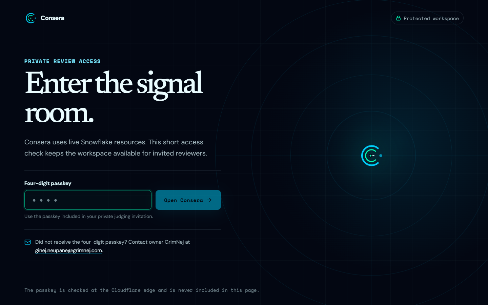
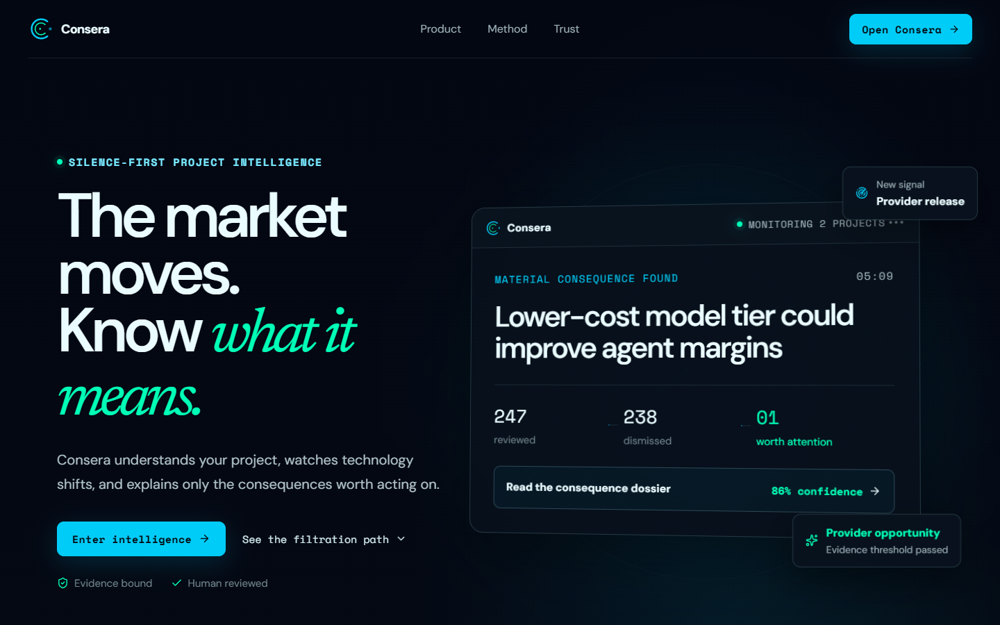
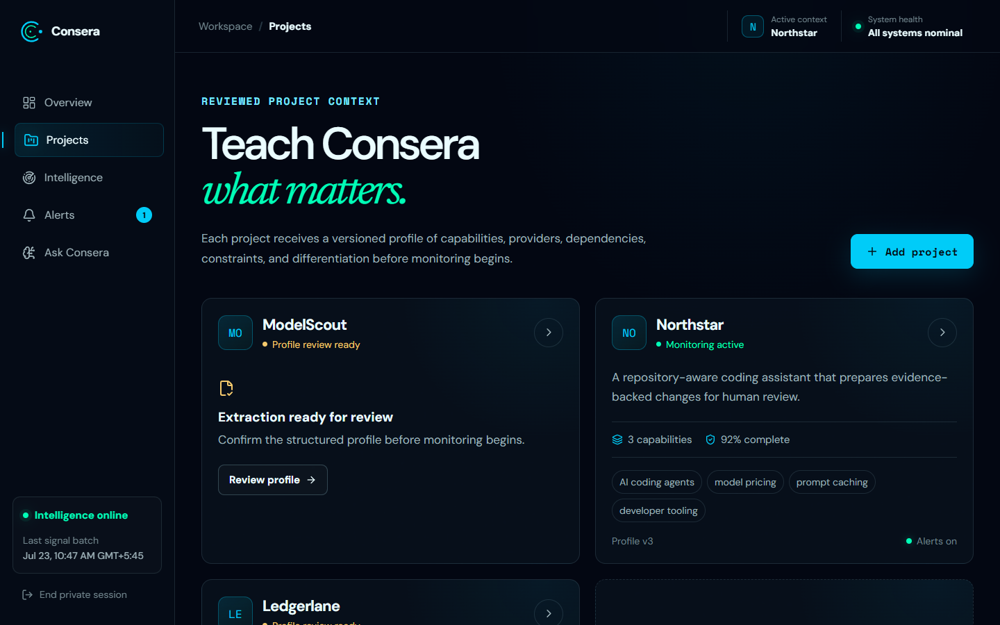
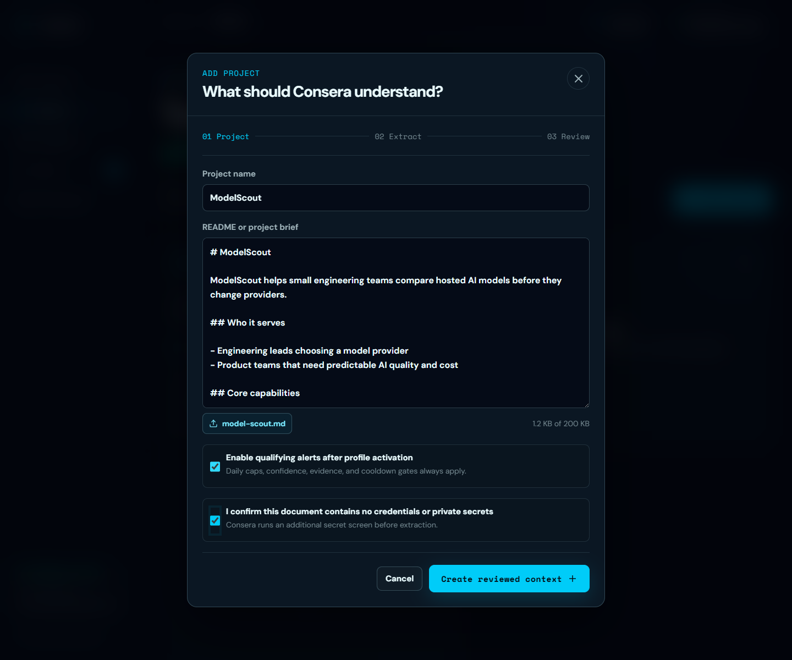
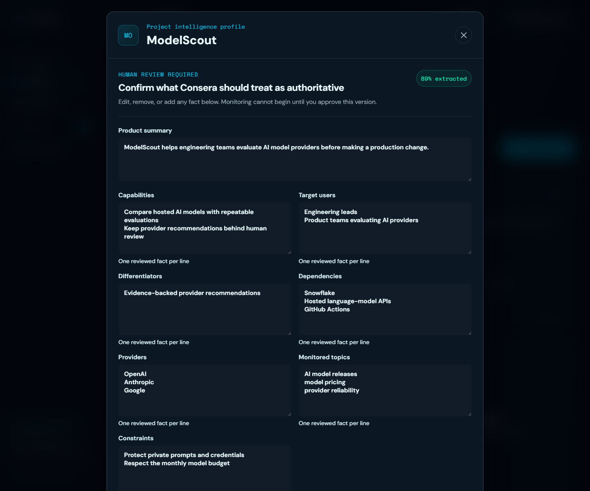
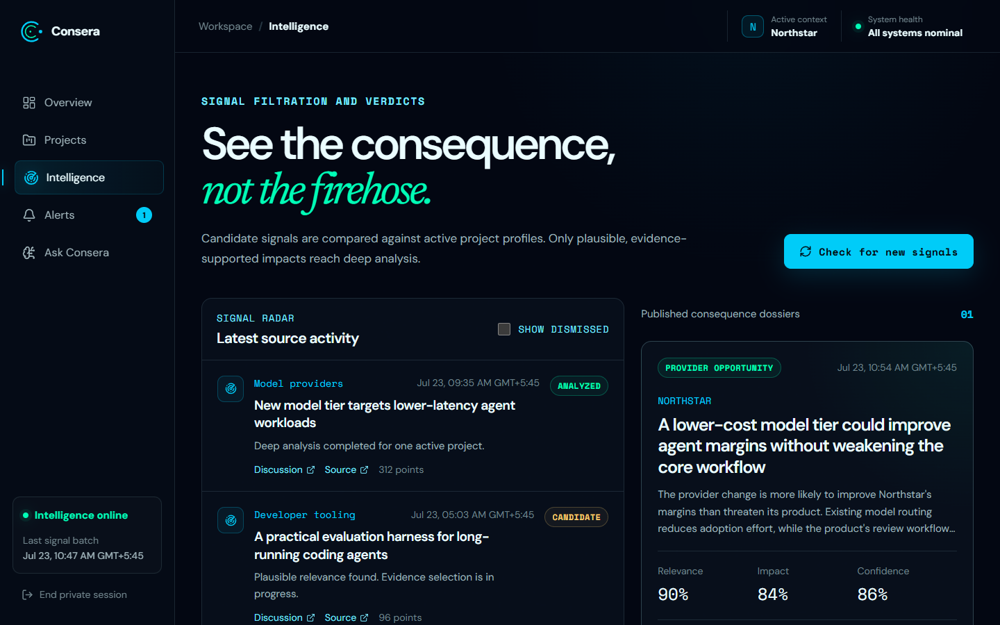
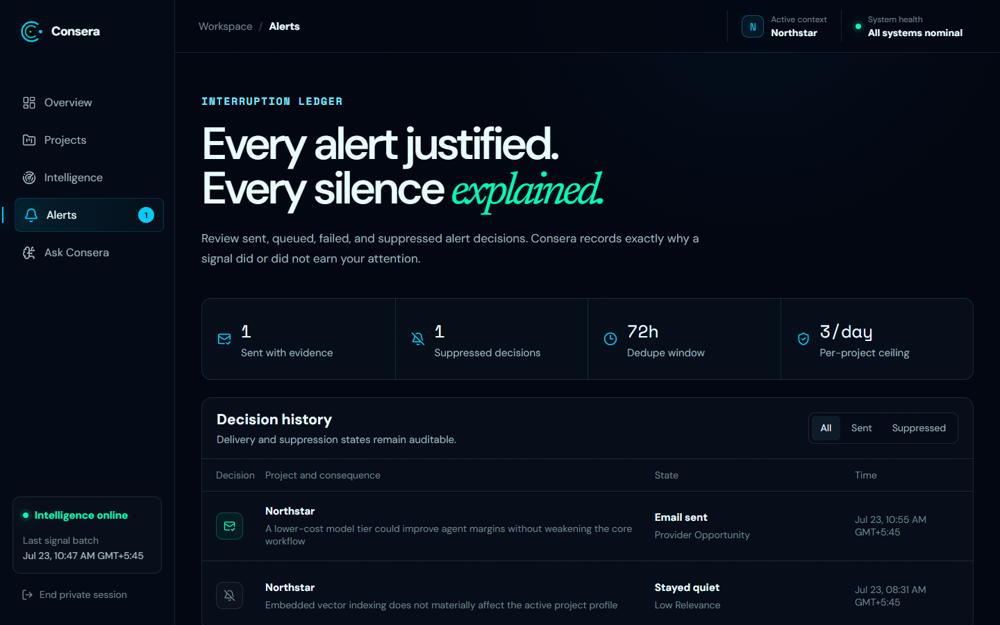
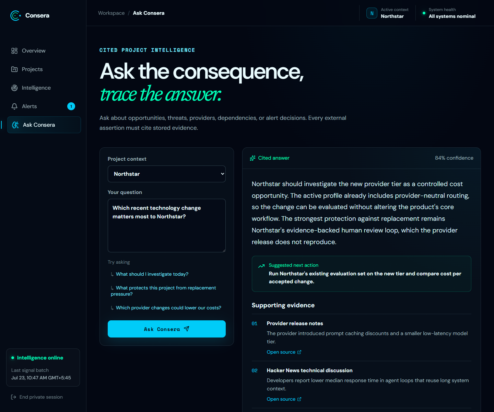

# Consera beginner guide

This guide takes you from the private access screen to a working, monitored project. You do not need
Snowflake knowledge to use the product.

## What Consera does

Consera learns what your project does from a Markdown or plain-text project brief. It then checks
new technology stories from Hacker News, ignores unrelated noise, and explains only the changes that
could affect your project. Every published consequence includes stored evidence. Email is sent only
when deterministic relevance, impact, confidence, and evidence rules all pass.

## Before you begin

Have these ready:

- the private four-digit passkey sent by the owner;
- a short project name;
- a UTF-8 `.md` or `.txt` project brief smaller than 200 KB;
- a document with no passwords, tokens, private keys, or confidential customer data.

You can use [the included example](examples/model-scout.md) for your first walkthrough.

## 1. Enter the private workspace

Open [consera.grimnej.com](https://consera.grimnej.com). Enter the four-digit passkey from your
invitation, then select **Open Consera**.

The passkey is checked by the Cloudflare Worker. It is not stored in the page or sent to Snowflake.
Your signed session lasts up to eight hours. Select **End private session** in the workspace sidebar
when you finish.

If you did not receive the passkey, email
[ginej.neupane@grimnej.com](mailto:ginej.neupane@grimnej.com).

## 2. Open the workspace

The landing page explains the product in one sentence: Consera watches technology shifts and tells
you only what changes your project. Select **Open Consera**.

The workspace opens on **Overview**. This page shows how many signals were reviewed, how many were
quietly dismissed, the current important consequence, and system health.

## 3. Go to Projects

Select **Projects** in the left navigation. This page contains each monitored project and its
reviewed profile. Select **Add project**.

## 4. Add your project document

Enter a clear project name. Then paste your Markdown into **README or project brief**, or choose a
UTF-8 `.md` or `.txt` file.

A useful brief should explain:

- what the project does;
- who uses it;
- its main capabilities;
- important frameworks, models, APIs, and providers;
- practical constraints, risks, and priorities;
- what makes it different from alternatives.

Do not write for an AI model. Write a normal project description with specific facts. Check the
confirmation that the document contains no credentials or private secrets, then select **Create
reviewed context**.

## 5. Review what Consera learned

Consera creates a versioned draft from the admitted document. Open the project when the profile is
ready. Check the summary, users, capabilities, dependencies, providers, monitored topics,
constraints, and the exact source excerpt.

Correct anything that is incomplete or inaccurate. Select **Approve and begin monitoring** only when
the profile describes the project correctly. The approved profile becomes the authoritative context
for future signal comparisons.

## 6. Check for new signals

Open **Intelligence**. Consera checks Hacker News automatically once each day. For an immediate
walkthrough, select **Check for new signals**.

The button queues the same bounded GitHub Actions ingestion used by the daily schedule. A manual run
can take several minutes. It does not force an alert. Most stories should remain silent because
unrelated news is the expected result.

## 7. Read consequences and alerts

On **Intelligence**, open a consequence dossier to see:

- what happened;
- why it matters to the selected project;
- relevance, opportunity, threat, replacement pressure, and confidence;
- protective factors and recommended actions;
- evidence links, contradictions, and limitations.

Open **Alerts** to see both sent and suppressed decisions. A suppressed row explains exactly why
Consera stayed quiet. Email goes only to the verified Consera recipient when the full alert policy
passes. Judges can verify the same decision and evidence in this page without needing access to the
recipient mailbox.

## 8. Ask a cited question

Open **Ask Consera**, choose an active project, and ask a focused question such as:

> What should this project investigate today?

The answer uses reviewed project facts, published verdicts, and stored evidence. The evidence drawer
shows where the answer came from.

## A good five-minute test

1. Enter the private workspace and open Consera.
2. Add the included `ModelScout` Markdown example.
3. Review and activate the extracted profile.
4. Open Intelligence and request a manual signal check.
5. Open an existing dossier and inspect its evidence.
6. Open Alerts and compare a sent decision with a suppressed one.
7. Ask, `What should this project investigate today?`

Expected result: the project becomes active, the manual check becomes queued, existing verified
intelligence stays available, and every material answer points to evidence. A new alert appears only
if an admitted story genuinely crosses the policy threshold.

## Troubleshooting

| What you see                     | What it means                                         | What to do                                                   |
| -------------------------------- | ----------------------------------------------------- | ------------------------------------------------------------ |
| Passkey not accepted             | The code is missing or incorrect                      | Use the private invitation code or contact the owner         |
| Too many attempts                | The edge rate limit protected the gate                | Wait one minute and try again                                |
| Last verified Snowflake snapshot | Live Snowflake is temporarily sleeping or unavailable | You can still inspect the timestamped read-only workspace    |
| Run queued                       | GitHub Actions accepted the manual check              | Wait a few minutes, then refresh Intelligence                |
| Profile still extracting         | The Snowflake profile job has not completed           | Reopen the project after a short wait                        |
| No new alert                     | No new story passed the full alert policy             | Inspect suppressed decisions to see why Consera stayed quiet |

For access or judging support, contact [Ginej Neupane (GrimNej)](mailto:ginej.neupane@grimnej.com).
